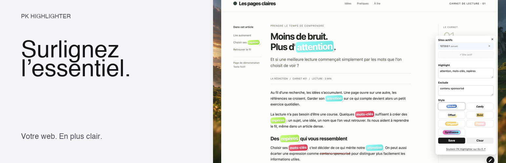
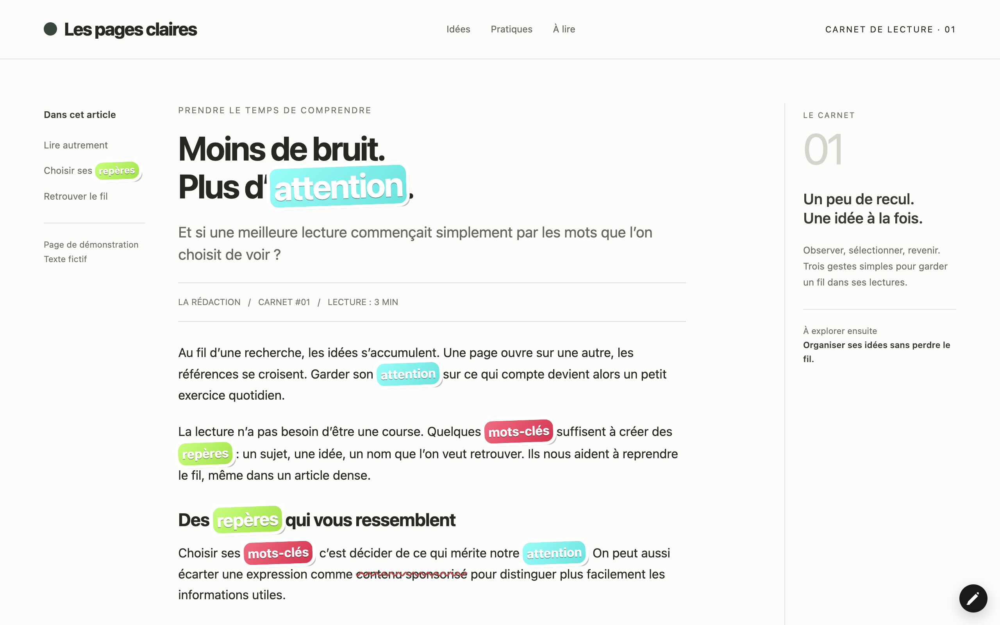

# PK Keyword Highlighter 🖍️

[🇬🇧 EN](README_en.md) · [🇫🇷 FR](README.md)

✨ A Chrome extension that highlights your keywords and strikes through excluded phrases, with seven visual styles.

Version: **2026.09.2**

## ✅ Features
- **Automatic highlighting**: keywords stand out immediately, with a stable colour per word.
- **Smart exclusion**: excluded phrases are struck through in red to prevent false positives.
- **Seven visual styles**: Sticker, Candy, Offset, Bold, Origami, Pastel and Synthwave.
- **Per-site activation**: the **HL** button opens the panel, "Add this site" enables highlighting.
- **Local persistence**: settings saved per site via local storage, nothing leaves your browser.

## 🧠 Usage
1. Click the **HL** button at the bottom of the page to open the panel.
2. Enable the current site ("+ Add this site").
3. Fill in your lists:
   - **Highlight**: words/phrases to highlight (comma-separated).
   - **Exclude**: words/phrases to strike through (comma-separated).
   - **Style**: pick one of the seven previewed renderings.
4. Click **Save**. The panel is draggable, your settings persist per site.

## ⚙️ Settings
- Exclusions are applied before highlighting.
- The script ignores input fields and its own UI panel.
- The panel includes a discreet support link to [Ko-fi](https://ko-fi.com/pouark).

## 🧪 Installation
- **Chrome Web Store** (recommended): [PK Highlighter](https://chromewebstore.google.com/detail/pk-highlighter/nnmkffkeilpnimdbiifhphpnflilhmno)
- **From source**: `chrome://extensions` → enable Developer Mode → "Load unpacked" → select the `src/` folder.

## 🧾 Changelog
- 2026.09.2: Bilingual promo landing, authentic media kit, Ko-fi link in the panel, manifest version format fix
- 2026.09.1: Store media kit (banner, card, screenshots, video, description)
- 1.0.0: Initial release.

Full history: [CHANGELOG.md](CHANGELOG.md)

## ❤️ Support

## 🔗 Links
- **Promo page**: [PK Highlighter landing](https://mondary.github.io/Chrome_PKhighlighter/store/)
- **Chrome Web Store**: [PK Highlighter](https://chromewebstore.google.com/detail/pk-highlighter/nnmkffkeilpnimdbiifhphpnflilhmno)
- **Source code**: [GitHub](https://github.com/mondary/Chrome_PKhighlighter)
- **Privacy policy**: [GitHub Pages](https://mondary.github.io/Chrome_PKhighlighter/store/privacy-policy-pk-highlighter.html)
- **Site**: [mondary.design](https://mondary.design)
- **Store dossier**: [store/description-store.md](store/description-store.md)
